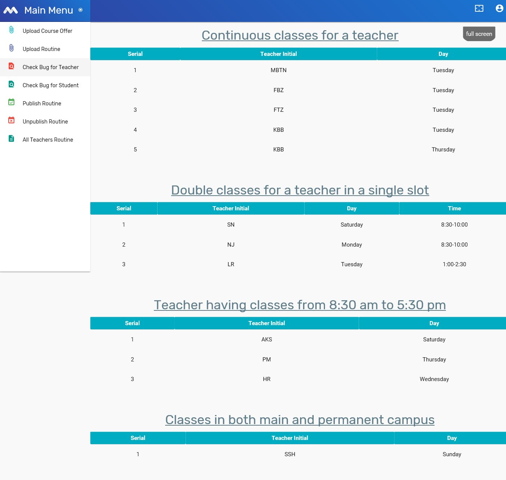
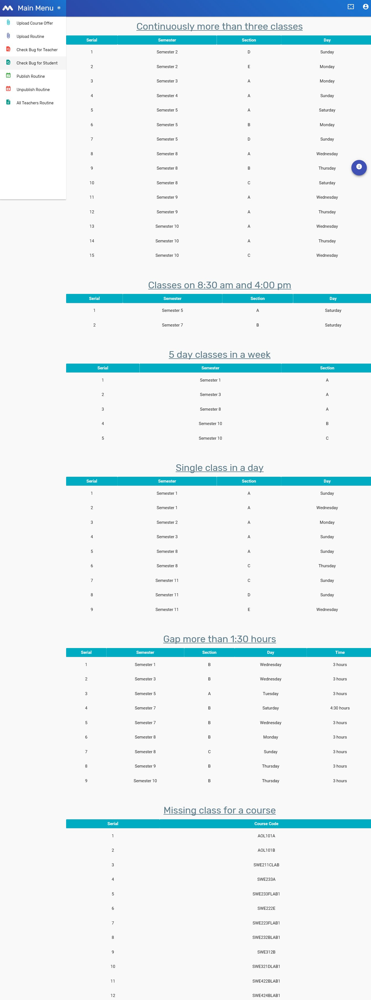
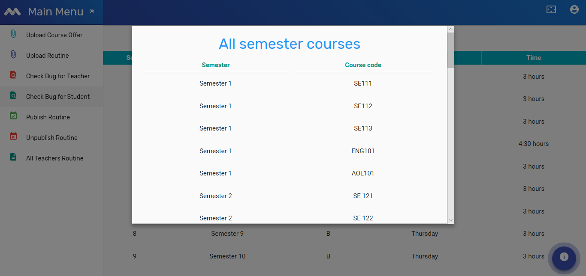
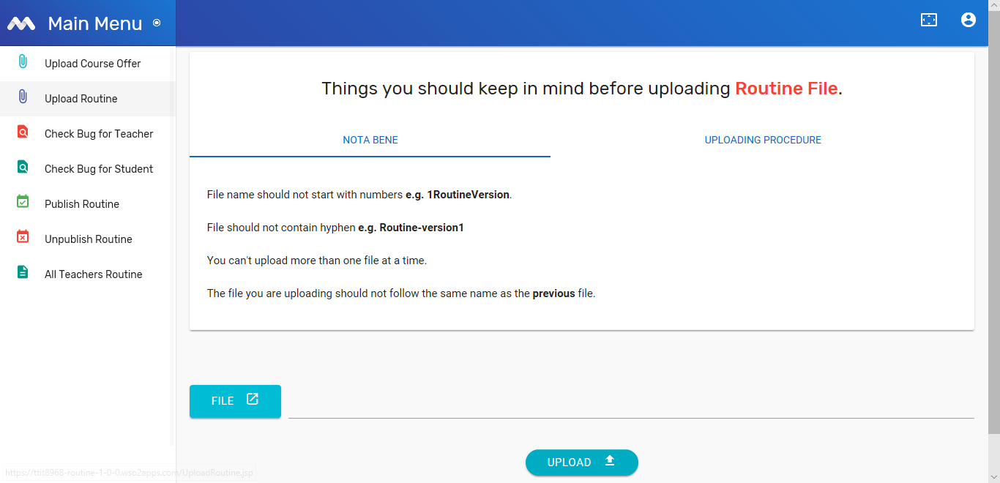
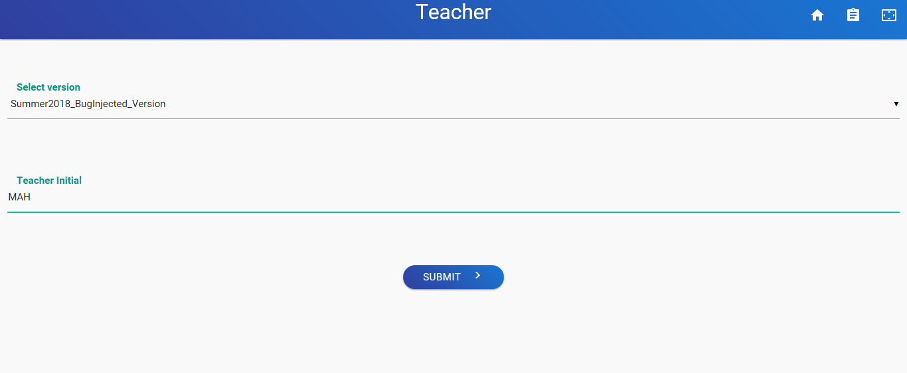
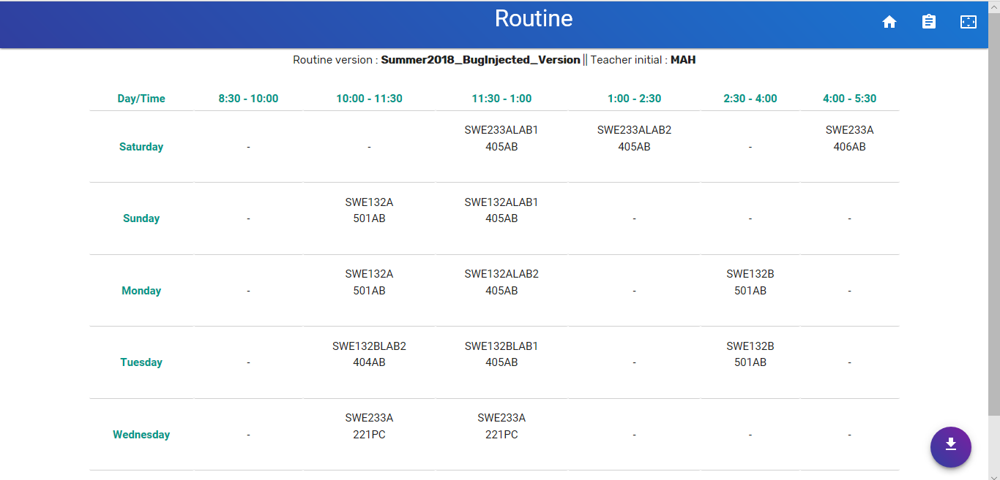
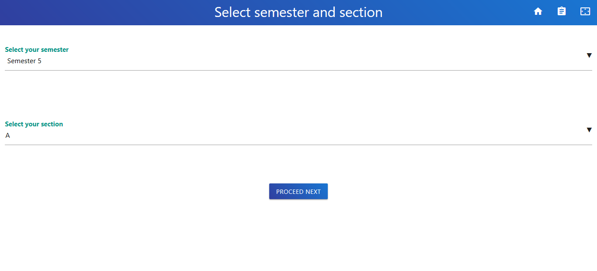
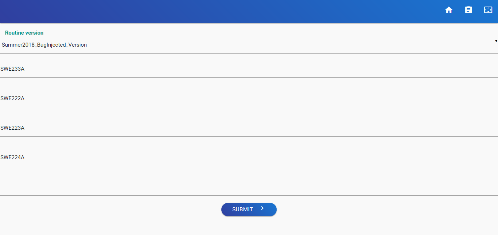
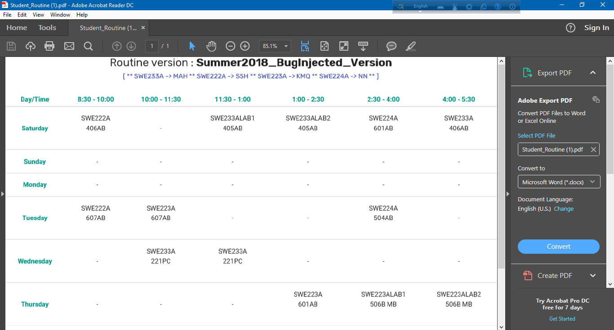

# Routine Explorer

A class routine explorer of DIU/SWE that helps finding class schedule from .xlsx file in a 6x6 GRID where student can find class schedule by selecting the routine version provided by the department and course code.

## Built With

* JSP , Java Servlet
* Materialize CSS
* jQuery , Ajax

## Snapshots

### Homepage

### Bug Report on Teacher's Schedule

### Bug Report on Student's Schedule

### Current Semester Courses Modal On Report Page

### Upload Routine & Course Offer

### Teacher's Routine (Individual)

### Student's Routine (Semester Wise: Individual)

### Download Routine As PDF

